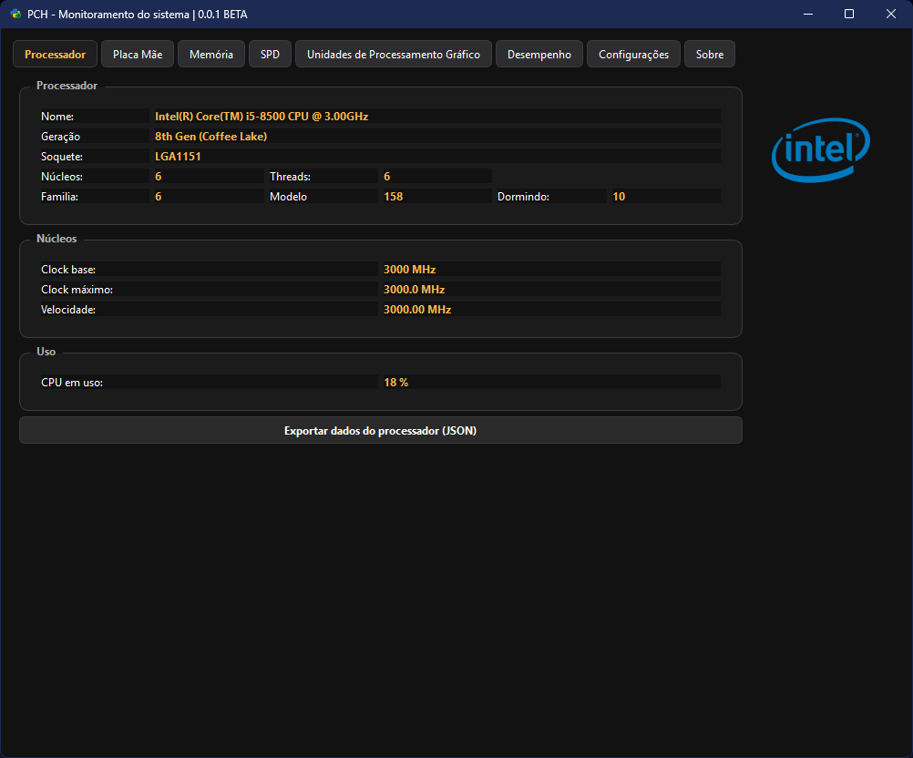
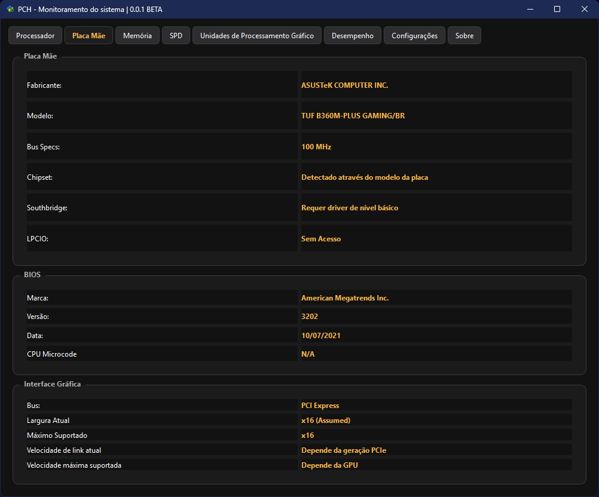
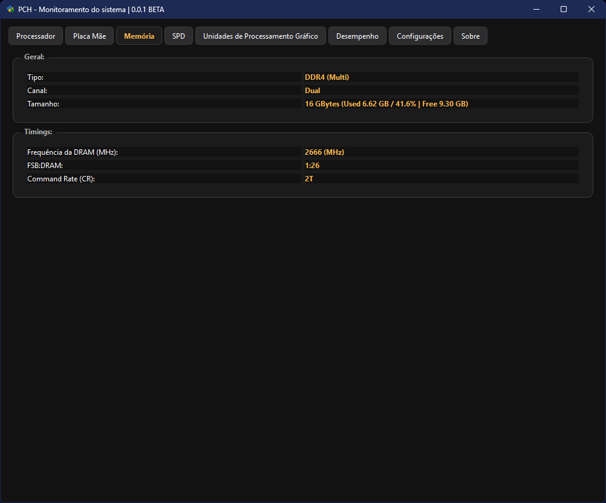
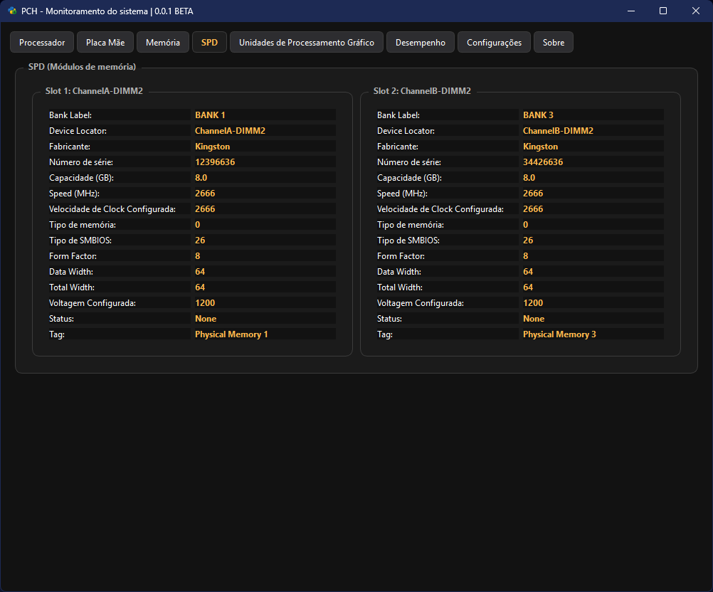
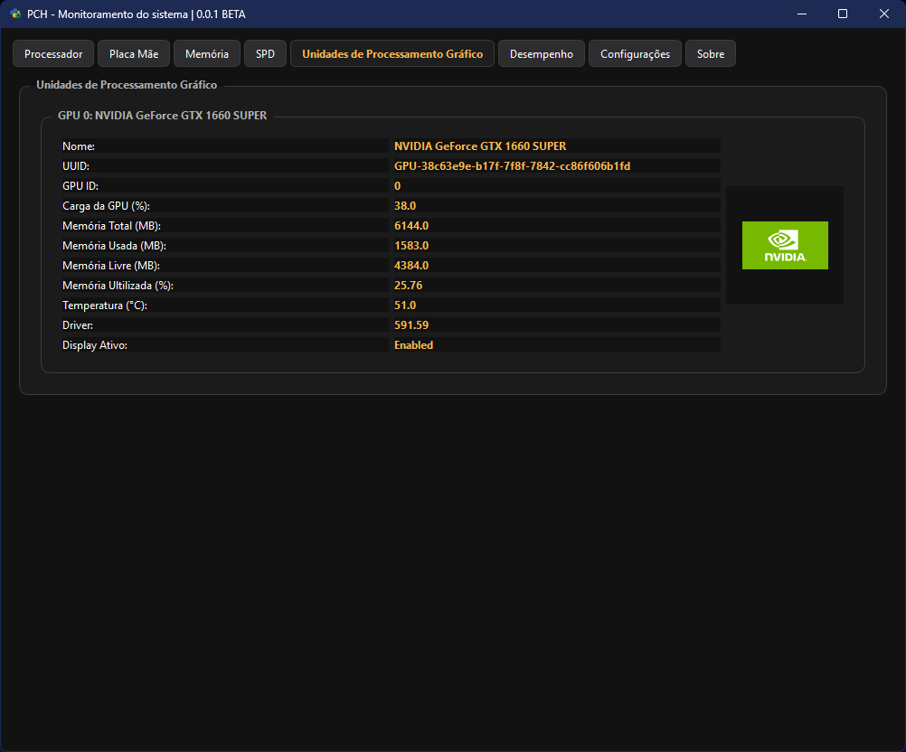
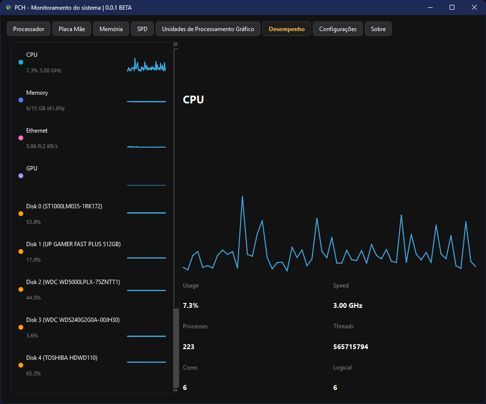
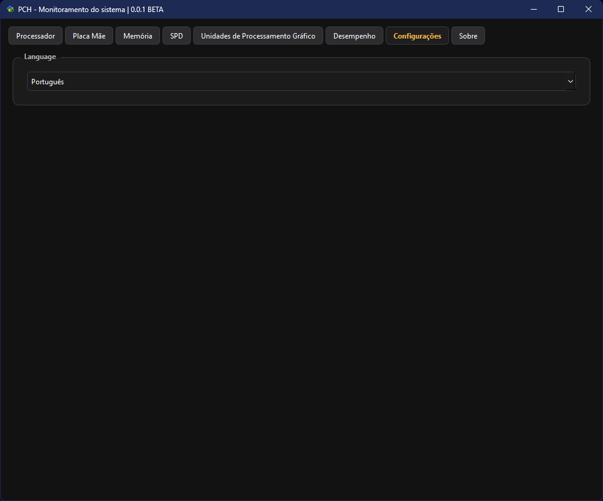

# 🖥 PHC – Monitoramento de Sistema

> **Um painel moderno de monitoramento de CPU, memória, GPU, discos e rede com interface inspirada no CPUz.**

---

## 🌟 Destaques

- Interface **limpa e minimalista** inspirada no CPUz e Windows 11  
- Atualização em **tempo real** de CPU, memória, discos, rede e GPU  
- **Gráficos dinâmicos** por dispositivo  
- Suporte a múltiplos discos e placas de vídeo  
- Layout responsivo e sidebar com cards interativos  

---

## 🖼 Demonstração

### ✅ Tela principal – CPU


### ✅ Placa Mãe


### ✅ Memória


### ✅ SPD


### ✅ GPU


### ✅ Monitor de desempenho


### ✅ Multi lang


---

## 🛠 Instalação

### Pré-requisitos

- Python 3.11+  
- Windows 10/11  
- Bibliotecas:  

### Executando

```bash
git clone https://github.com/seu-usuario/benchmaster.git
cd PcHealthApp
pip install -r requiriments.txt
python main.py
```

> O aplicativo abrirá com a interface principal, mostrando todos os dispositivos detectados.

---

## 🎨 Design inspirado no CPUz e Windows 11

- **Cores suaves**, cantos arredondados, e sombras discretas  
- **Sidebar interativa** com cards selecionáveis  
- **Gráficos de uso** minimalistas para cada dispositivo  
- **Hover animations** nos cards para feedback visual  

---

## 🧩 Sugestões de melhorias futuras

- Suporte a **monitoramento de múltiplas GPUs**  
- Exportar relatórios em **CSV ou PDF**  
- Tema claro/escuro  
- Notificações quando algum dispositivo atingir limite crítico  

---

## 📌 Contato

- GitHub: [Francis Taylor](https://instagram.com/slash.baiano)

## 📌 Contribuidores

- GitHub: [Henx]([https://instagram.com/slash.baiano](https://github.com/hvqiws))  

> Feito com ❤️ Python e PyQt6
